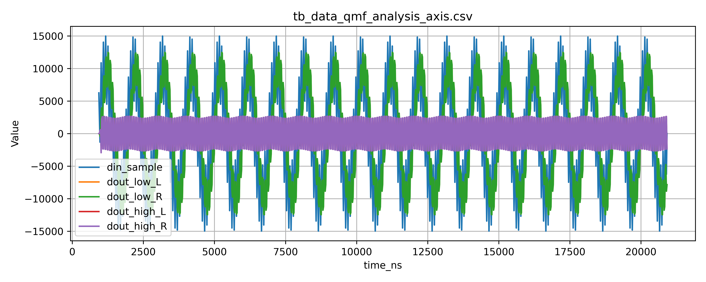
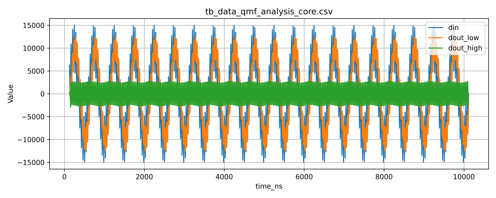
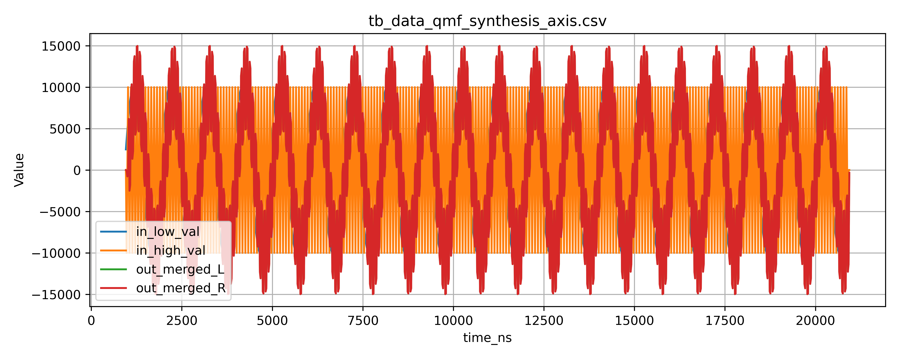
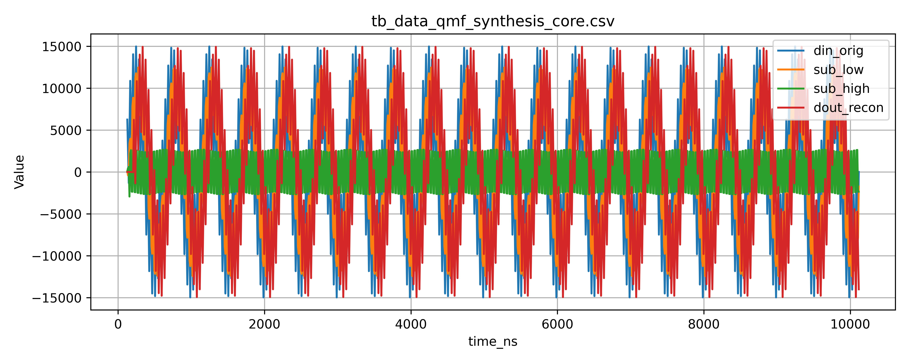
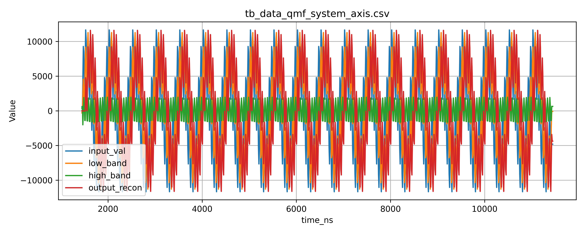

# QMF Testbench Results

Folder ini berisi **hasil simulasi (CSV + plot)** dari seluruh testbench
Quadrature Mirror Filter (QMF) yang tersedia di repository ini.

Setiap hasil terdiri dari:
- **File CSV** → data numerik mentah dari testbench
- **Plot PNG** → visualisasi waveform untuk inspeksi manual

> Semua plot ditujukan untuk **visual sanity check**, bukan evaluasi metrik otomatis.

---

## 1. QMF Analysis — AXI Wrapper

**File:**
- `tb_data_qmf_analysis_axis.csv`
- `tb_data_qmf_analysis_axis.png`

**Isi plot:**
- Input audio (stereo)
- Output subband low (L/R)
- Output subband high (L/R)

---

## 2. QMF Analysis — Core (Non-AXI)

**File:**
- `tb_data_qmf_analysis_core.csv`
- `tb_data_qmf_analysis_core.png`

**Isi plot:**
- Input sample
- Low-band output
- High-band output

---

## 3. QMF Synthesis — AXI Wrapper

**File:**
- `tb_data_qmf_synthesis_axis.csv`
- `tb_data_qmf_synthesis_axis.png`

**Isi plot:**
- Low-band input
- High-band input
- Reconstructed stereo output (L/R)

---

## 4. QMF Synthesis — Core (Non-AXI)

**File:**
- `tb_data_qmf_synthesis_core.csv`
- `tb_data_qmf_synthesis_core.png`

**Isi plot:**
- Original input
- Subband low
- Subband high
- Reconstructed output

---

## 5. QMF System — AXI (End-to-End)

**File:**
- `tb_data_qmf_system_axis.csv`
- `tb_data_qmf_system_axis.png`

**Isi plot:**
- Input audio
- Low-band signal
- High-band signal
- Reconstructed output

---

## 6. QMF System — Core (End-to-End, Non-AXI)

**File:**
- `tb_data_qmf_system_core.csv`
- `tb_data_qmf_system_core.png`

**Isi plot:**
- Original input
- Low-band output
- High-band output
- Final reconstructed signal

---

## Notes on Interpretation

- CSV logs **tidak cycle-aligned** dengan output karena adanya pipeline latency.
- Plot digunakan untuk:
  - Verifikasi pemisahan subband
  - Validasi rekonstruksi sinyal
  - Inspeksi fixed-point behavior
- **Tidak dimaksudkan** untuk:
  - THD / SNR measurement
  - Automated regression testing
  - Performance benchmarking

---

## Status

✔ Semua testbench berjalan konsisten  
✔ Output sesuai ekspektasi QMF Johnston 8A  
✔ Hasil dianggap **final dan stabil**

Scope folder ini **dibekukan** untuk menjaga konsistensi dokumentasi
dan keterbandingan antar modul DSP di repository terkait.
